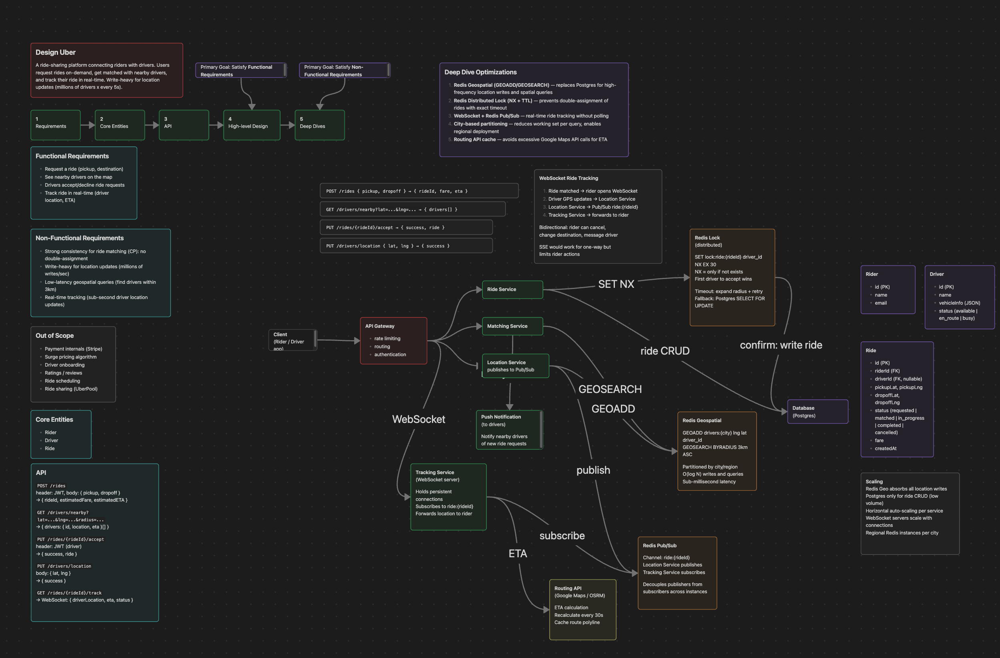

# System Design Expert

A system design knowledge base and interview prep tool, built for [Claude Code](https://docs.anthropic.com/en/docs/claude-code).

You give it a system design problem. It produces a structured solution (requirements, APIs, schemas, deep dives) and two architecture diagrams you can open in Obsidian or Excalidraw: a Base design that just works, and a Deep design that scales.



## What's inside

- **`_Brain.md`**: a self-contained knowledge base of system design concepts (CAP theorem, caching, sharding, consistent hashing, fan-out, operational transformation, rate-limiting algorithms, bloom filters, and more), compiled from the source notes.
- **`Problems/`**: six solved problems, each with a full written solution plus Base and Deep architecture diagrams. Every problem folder splits its diagrams into `Canvas/` (Obsidian Canvas) and `Excalidraw/`.
- **`Sources/`**: detailed breakdowns distilled from system design interview walkthroughs, the raw material the brain is compiled from.
- **`canvas_to_excalidraw.py`**: converts an Obsidian `.canvas` into an `.excalidraw.md`.

### Solved problems

| Problem | The interesting part |
|---|---|
| Ticketmaster | Booking consistency, virtual waiting queue, distributed locks |
| Uber | Geospatial matching, real-time location, surge |
| Twitter Feed | Fan-out on write vs read, the celebrity problem |
| URL Shortener | Key generation, read-heavy caching, redirects |
| WhatsApp | WebSocket routing, offline delivery, presence |
| Google Docs | Operational transformation, real-time collaboration |

Each problem keeps the same shape: Base is the naive "it works but does not scale" design, Deep adds the optimizations (caching, queues, sharding, distributed locks, real-time channels) with a summary node showing exactly what changed.

## Example prompts

Talk to it like a study partner. A few to start:

```
/system-design solve Distributed Message Queue
/system-design solve Top K Leaderboard on a 1B-event stream
/system-design explain how CRDTs differ from operational transformation
/system-design explain when to fan out on write vs on read
/system-design review
```

`solve` writes the solution and diagrams to disk. `explain` and `review` answer from the brain. See the full breakdown below.

## Setup

Requires [Claude Code](https://docs.anthropic.com/en/docs/claude-code).

```bash
git clone https://github.com/Pawel-Kica/system-design-expert
cd system-design-expert
```

Open Claude Code in the repo. The `/system-design` command is available right away. See [SETUP.md](SETUP.md) for a two-minute walkthrough.

## Usage

### Solve a new problem

```
/system-design solve Chat System
```

Generates a full solution (requirements, core entities, APIs, high-level design, deep dives) and two architecture canvases (Base and Deep), saved under `Problems/<Name>/`.

### Explain a concept

```
/system-design explain consistent hashing
```

Explains the concept from the brain. If the brain is thin on it, pulls from the source notes.

### Review your knowledge

```
/system-design review
```

A structured overview of everything in the brain by category, with thin areas flagged and suggestions for what to study next.

### Update the brain

```
/system-design update
```

Regenerates `_Brain.md` from everything in `Sources/` and `Problems/`. Run it after adding new source material.

## Obsidian integration

The `.canvas` files open natively in [Obsidian](https://obsidian.md). Open this repo as a vault to browse the architecture diagrams, follow the `[[wikilinks]]` between concepts, problems, and sources, and use the knowledge base as a second brain. The `.excalidraw.md` files open with the Excalidraw plugin if you prefer that view.

## Adding your own sources

Drop a note, transcript, or article into `Sources/`, then run `/system-design update` to fold it into the brain.

## Credits

The methodology (requirements, core entities, APIs, high-level design, deep dives, and the Base vs Deep split) follows [HelloInterview](https://www.hellointerview.com/). The source notes are distilled from their excellent ["Design X w/ an Ex-Meta Staff Engineer" YouTube series](https://www.youtube.com/playlist?list=PL5q3E8eRUieWtYLmRU3z94-vGRcwKr9tM). Go watch the originals.

## License

MIT
